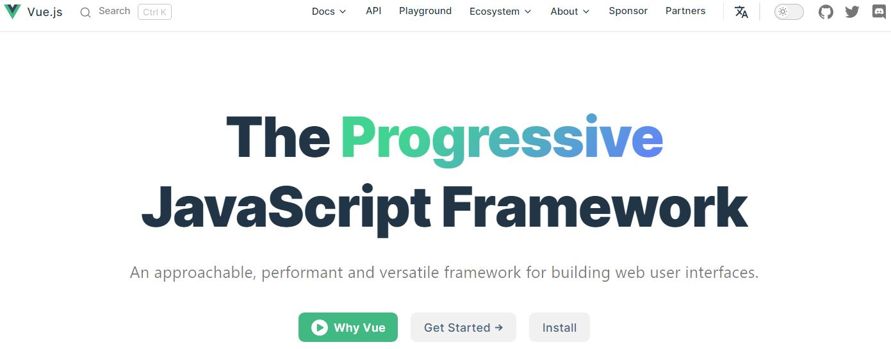

# vue.js-intro
Learning the fundamental and essential components of Vue.js version 3

# What's Vue.js (Based on Vue Docs)
A JavaScript framework for building user interfaces. It builds on top of standard HTML, CSS, and JavaScript, and provides a declarative and component-based programming model that helps you efficiently develop user interfaces, they can be simple or complex.

# Installing Vue.js
When you go to the official home page "https://vuejs.org/", you will see the "Install" button. 



Then the page ["Quick Start"](https://vuejs.org/guide/quick-start.html) will show you the different options to use/install/download Vue.js:

- [Creating a Vue Application](https://vuejs.org/guide/quick-start.html#creating-a-vue-application):
- [Using Vue from CDN](https://vuejs.org/guide/quick-start.html#using-vue-from-cdn)

Another option is currently in maintenance mode. It is ["Vue CLI"](https://vuejs.org/guide/scaling-up/tooling.html#vue-cli). You can also use Vue CLI, which is the official webpack-based toolchain for Vue. But Vue will tell us this:
*"It is now in maintenance mode and we recommend starting new projects with Vite unless you rely on specific webpack-only features. Vite will provide superior developer experience in most cases."*
The current alternative is Vite *(check the info at the end of this readme file)*.

It will be also used to demonstrate the classical way of installing Vue in the final sub-folder of this repo.

# Working with CDN Link:
For starting with a quick demonstration of the main Vue features and components, we will use the Vue link from the CDN first, then we can demonstrate the use of "Single File Components" later.

In the main repo folder, I manually added/created the "css" folder for styling our application. It contains CSS3 media queries and the same template that we used before for our quick RWD demo. An empty "js" folder and "data" folder that contains a "data.js" file which contains an array of a literal JS object named "packages" that contains brief info about the common Java Language Packages.

- Using Vue from CDN:
You can [use Vue directly from a CDN](https://vuejs.org/guide/quick-start.html#using-vue-from-cdn) via a script tag:
```
<script src="https://unpkg.com/vue@3/dist/vue.global.js"></script>
```
Based on Vue docs: This URL is using "unpkg.com", but you can also use any CDN that serves the "npm package", for example, jsdelivr or cdnjs. Or you can also download this file and serve it yourself.

# Implementing Vue and API Reference:
Vue components can be authored in two different [API styles](https://vuejs.org/guide/introduction.html#api-styles): 
- [Options API](https://vuejs.org/guide/introduction.html#api-styles) => the one we use in this repo
- [Composition API](https://vuejs.org/guide/introduction.html#api-styles)

To decide which style/way to use, you can check this article about [which one to use](https://vuejs.org/guide/introduction.html#which-to-choose)

Vue can be used within HTML elements when it's embedded to our normal HTML files as HTML attributes using Vue directives or Vue Templates by just calling "CDN" library or by using [SFC (Single-File Components)](https://vuejs.org/guide/scaling-up/sfc.html)

# Reading Path:
To review the topic in chronological order from the beginning to the end moving from the basic to more advanced topic follow this folder sequence, inside each folder you will see the file listed with numbers: file1, file2, ... and you can follow them in the same sequence:
- P1-Content-Behaviour
- P2-Form-Bindings
- P3-Rendering-Styles
- P4-Basic-Components
- P5-CLI-Single-File:
  - "sfc-cli-demo-app" => This folder just contains the default "Single File Components" after running Vue/CLI
  - "vue-cli-demo-app" => This folder is for demonstrating "Single File Components" for our "Java-Packages" after running Vue/CLI to be built using SFC

# Working with Single-File Components [SFC]
The other way of working with Vue components is by defining them in files with the .vue extension. This is what is called ["Single-File Components"](https://vuejs.org/guide/scaling-up/sfc.html).

Vue SFC is a natural extension of the classic trio of HTML, CSS, and JavaScript. It includes these 3 tag blocks:
- "< template >" => The view
- "< script >" => The logic
- "< style >" => The styling

All three blocks encapsulate and colocate the view, logic, and styling of a component in the same file. 


Because web browsers cannot support .vue files, they are needed to be converted or complied to JavaScript files (.js) with a bundle tool like "[Webpack](https://webpack.js.org/)", which takes modules with dependencies and generates static assets representing those modules, or using ["Vue CLI"](https://vuejs.org/guide/scaling-up/tooling.html#vue-cli) (Command Line Interface) which is the official webpack-based toolchain for Vue. It's used to configure "Webpack" for our application and make the building process easier and simpler. The official link for [Vue-CLI Guide](https://cli.vuejs.org/). 

NOTE: When we open the Vue CLI page, we will see this message:
*"It is now in maintenance mode and we recommend starting new projects with Vite unless you rely on specific webpack-only features. Vite will provide superior developer experience in most cases."*

To learn more about these two different tools check ["Project Scaffolding with Vite and Vue CLI"] (https://vuejs.org/guide/scaling-up/tooling.html#project-scaffolding)

For demonstrating the essentials of Vue.js based on the many application that was built with this tool, we will use it then we can also use "create-vue" to scaffold Vite-based projects.
We can start by clicking the button on the home page "Get Started ->" to take us to the "[Get Started Page](https://cli.vuejs.org/guide/)"

# SFC CLI Installations and Implementations:
The initial demonstration for using and installing Vue/CLI tool will be demonstrated inside a sub-folder "P5-CLI-Single-File". For Getting Started, we need to install "Vue CLI". We can use "Node Package Manager" since we have node (LTS) already installed. 

## Before installing:
- Make sure you have an up-to-date version of Node.js installed which is mandatory for most of the JavaScript libraries and frameworks.
- Install the Vue official extension ["Vue Language Features (Volar)"](https://marketplace.visualstudio.com/items?itemName=Vue.volar) for supporting the code highlighting for .vue files (You can do this steps later).
-Navigate to your newly created folder. By using NPM, run the following commands as explained in the two steps below in a command line Interface: "GitBach, VS Code Terminal, PowerShell".

## Step#1: installing vue-cli
In Express, we created a main folder to be the container for our application folder later. Then inside the main folder, we run the npm commands for creating the project/application folder.

We do the same with Vue. In this repo, my main folder to run the npm command for installing all the Vue components based on the folders sequence as I mentioned before is: **"P5-CLI-Single-File"** which is the last sub-folder in this repo.

Inside the folder "P5-CLI-Single-File", you can run this command to install vue/cli globally: 
> npm install -g @vue/cli

You can check the latest release info (version and date) of Vue-CLI by going to its [Official GitHub Repo](https://github.com/vuejs/vue-cli). Notice that you can easily click on the "GitHub" link from the top menu of the Vue-CLI page to access its GitHub official repo.
You can run this command to test the version:
> vue --version

### The output/result of installing Vue/CLI
After installing vue/cli inside your folder, you will have the following:
- node_modules => as usual for every npm install
- package-lock.json => we don't use this file
- package.json => the one that we use/modify as developers

The package.json file will have:
```
{
  "dependencies": {
    "@vue/cli": "^5.0.8"
  }
}
```

## Step#2: Creating our project with Vue/CLI
Inside the same project folder, run this command:
> vue create "YourApp-Name" 

> vue create sfc-cli-demo-app 
we can use "Vue3" which is the default "Preset" by pressing "Enter"

After finishing the installation, Vue will provide the following info:

🎉  Successfully created project sfc-cli-demo-app. <br>
👉  Get started with the following commands: <br>
> $ cd sfc-cli-demo-app 
> $ npm run serve

## Step#3: Run the Vue Project
Based on the info from the previous command, navigate to the application folder, in my case it's **"sfc-cli-demo-app"**, then run the command:
> npm run serve 
Vue will use the port "8080" => http://localhost:8080/
It's the link for our local dev server.

If we want to deploy our application to a production server, we need to use:
> npm run build

You will see the output:
 App running at:
  - Local:   http://localhost:8080/
  - Network: http://10.0.0.238:8080/

Note that the development build is not optimized.
 To create a production build, run npm run build.


This command will create a "dist" directory that contains an optimized version that would work on any web server.

When opening the URL "http://localhost:8080/", you will see the default welcome screen for Vue Application:


## The Application Directory
We will have a project/application directory that contains the following:
- node_modules (folder) as usual :-) <=> should be ignored with git
- public (folder):
    - favicon.ico
    - **index.html** <==> Where the Vue app template will be generated (automatically injected into div#app element based on the code inside the file "main.js")
- src (folder):
    - assets (folder)
    - components (folder)
    - **App.vue** <==> The root components of our Vue application (Contains the parent options object to be imported inside the "main.js" file)
    - **main.js** <==> The entry-point JS file for our application where the app is created and mounted to #app element
- **component (folder):** <==> The folder where we add our components
    - **HelloWorld.vue** <==> The default .vue component that come with Vue CLI commands
- .gitignore
- babel.config.js
- package-lock.json
- package.json
- README.md

We can direct our focus to these project directories:
- "public" directory for the HTML pages. 
- "src" directory for "main.js" and "App.vue" files.

**"index.html"** file has the div element with an id of "app". This page doesn't include a script tag for loading Vue as we did in the previous examples, because the development server will just automatically inject them as shown in the comment:
```
    <div id="app"></div>
    <!-- built files will be auto injected -->
```
### IMPORTANT NOTE:
Notice that we can build and run our application locally, but when we need to deploy it into a hosting server, we have to run the command *"npm run build"* instead of *"npm run serve"*.

**"main.js"** file has the code for creating our app object and mounting it to our HTML page as we did in our previous examples by adding a script tag at the end of our HTML page and writing our JS/Vue code inside it. This file "main.js" is **the entry-point to our Vue application**. 

Instead of defining our options object, we import it from "App.vue" file:
```
import { createApp } from 'vue'
import App from './App.vue'

createApp(App).mount('#app')
```

**"App.vue"** file (inside "src" folder) is for "SFC" and it's like the **root** components of our Vue application. You can think about it as the Vue root instance that we defined in our options object in the previous HTML files, but in "App.vue", the Vue instance defines its own template within the template tag:
```
<template>
  
  <HelloWorld msg="Welcome to Your Vue.js App"/>
</template>
```

Also in this file, we have the "script" tag, and Vue is importing the child components "HelloWorld" from the main template above it:
```
<script>
import HelloWorld from './components/HelloWorld.vue'

export default {
  name: 'App',
  components: {
    HelloWorld
  }
}
</script>
```

And finally, the optional "< style >" element:
```
<style>
#app {
  font-family: Avenir, Helvetica, Arial, sans-serif;
  -webkit-font-smoothing: antialiased;
  -moz-osx-font-smoothing: grayscale;
  text-align: center;
  color: #2c3e50;
  margin-top: 60px;
}
</style>
```
## Vue Development Server
Notice that Vue development server has a useful feature **"Automatic Reloading"**. Any change we make on the file will immediately be reflected on our running app in the browser which is similar to using "nodemon" in ExpressJS application.

You can try it by opening the file "App.vue". In my case: the relative path for this file "P5-CLI-Single-File\sfc-cli-demo-app\src\App.vue". Then changing for example the value of "msg" prop from "Welcome to Your Vue.js App" to any other message and it will be changed in the browser instantly. 

# Analyzing the SFC Files Deeply:
- "App.vue" file (inside "src" folder):
Has the script tag with the following code to show the *"components:"* options for registering a child component named "HelloWorld" which is another way to register a component:
```
export default {
  name: 'App',
  components: {
    HelloWorld
  }
}
```
NOTE:
In the previous HTML files, we used the component method for our Vue object "app" => "app.component.()" to **globally** register component options so they can be used anywhere in the application. But using "components" as an option is a way to **locally** register components as "Child Components" of the root App components.

# Building our own SFC App:
Instead of repeating the whole steps of creating the SFC default folders and files, we will just modify the same application folder from the previous steps.

## Modify the App.vue:
1- The default code:
```
<template>
  
  <HelloWorld msg="Welcome to Your Vue.js App"/>
</template>
```
- The new one: check the comment
```
<HelloWorld msg="Welcome to Your Vue.js App" />
```

2- The default code:
```
import HelloWorld from './components/HelloWorld.vue'
```

- The new one:
```
import PackageName from './components/PackageName.vue'
```

2- The default code:
```
export default {
  name: 'App',
  components: {
    HelloWorld
  }
}
```
The new one:
```
export default {
  name: 'App',
  components: {
    // Register "PackageName" to be a local component:
    // PackageName
  }
}
```
## The code of our application PackageName.vue:
1. Inside template element:
```
<template>
  <div class="main-content">
    <h1>{{ mainHeading }}</h1>
    <p>
      To learn more about Java modules and packages
      <a href="https://docs.oracle.com/en/java/javase/17/docs/api/index.html" target="_blank" rel="noopener">
        Java17 API Docs
      </a>.
    </p>
  </div>
</template>
```

2. Inside the script element:
```
export default {
  // Giving our component a name (which is the same name as the file similar to Vue template code):
  name: 'PackageName',
  // Adding the props as object properties (Like Vue template) or as an array elements as we did:
  // Just having the "name" prop in the array:
  /*   
  props: {
      msg: String
  }, 
  */
  props: ['mainHeading']
}
```

3. Adding some styles => you can check the code with comment about "scoped" Vue attribute

## Adding our own .vue component file:
Inside the "component" folder, adding our file "PackageName.vue" using the same PascalCase naming convention like the default one "HelloWorld". Adding the same 3 blocks from the default Vue file:
- template element
- script element
- style element

Refer to the file "PackageName.vue" to see the code and read the comment

# SFC Vite Installations and Implementations:
Vite is a build tool that aims to provide a faster and leaner development experience for modern web projects. we can start by the topic ["Scaffolding Your First Vite Project"](https://vitejs.dev/guide/#scaffolding-your-first-vite-project).

Now to continue from here, you can select any way you prefer for learning based on the very nice tutorials from Vue: ["Pick Your Learning Path"](https://vuejs.org/guide/introduction.html#pick-your-learning-path)


# References, Resources, and Credits: 
- [Michael Sullivan](https://github.com/regularmike): Microsoft Certified Professional and Senior Web Developer
- [Vue Guide](https://vuejs.org/guide/introduction.html)
- [Vue Tutorial](https://vuejs.org/tutorial/#step-1)
- [Vue Quick Start](https://vuejs.org/guide/quick-start.html)
- [Getting started with Vue](https://developer.mozilla.org/en-US/docs/Learn/Tools_and_testing/Client-side_JavaScript_frameworks/Vue_getting_started)
- [Getting started with Vue: MDN](https://developer.mozilla.org/en-US/docs/Learn/Tools_and_testing/Client-side_JavaScript_frameworks/Vue_getting_started)
- [Vue Mastery Youtube Channel](https://www.youtube.com/c/VueMastery/about)
- [Airbnb JavaScript](https://github.com/airbnb/javascript)
- [Stack Overflow Question Forms](https://stackoverflow.com/questions)

